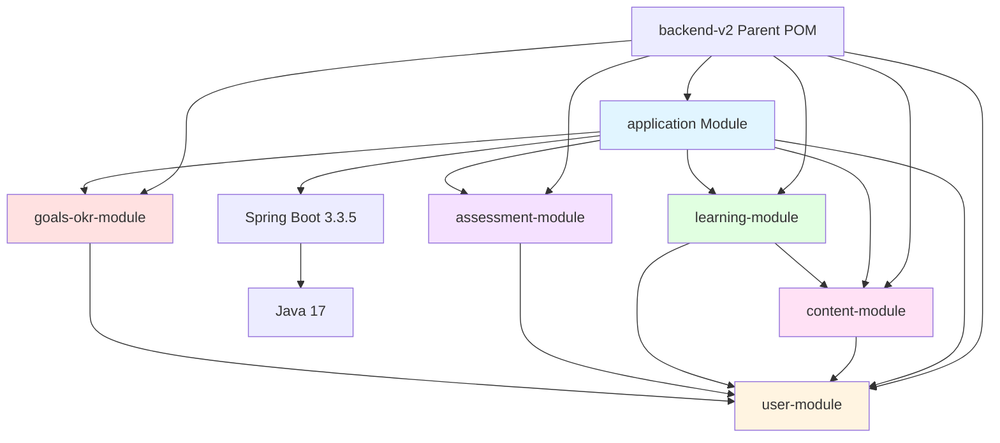
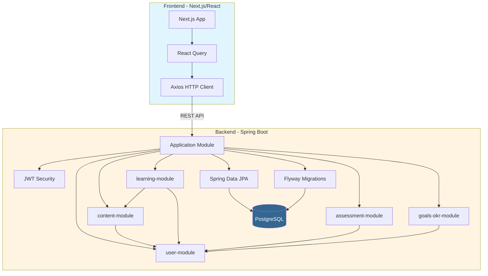

# Dependency Graph - Wheel of Islam Falah App

## Overzicht

Deze applicatie bestaat uit twee hoofdcomponenten:
- **Frontend**: Next.js/React applicatie
- **Backend**: Spring Boot modular monolith (Maven multi-module)

---

## Backend Dependency Graph

### Module Hiërarchie (Mermaid Diagram)



### Module Hiërarchie

```
backend-v2 (parent POM)
│
├── application (Spring Boot Application)
│   ├── user-module
│   ├── content-module
│   │   └── user-module
│   ├── learning-module
│   │   ├── user-module
│   │   └── content-module
│   │       └── user-module
│   ├── assessment-module
│   │   └── user-module
│   └── goals-okr-module
│       └── user-module
│
└── [Alle modules]
    └── Spring Boot 3.3.5
        └── Java 17
```

### Module Dependencies

```
┌─────────────────┐
│   application   │ (Spring Boot Starter)
└────────┬────────┘
         │
         ├──► user-module
         ├──► content-module ──► user-module
         ├──► learning-module ──► user-module
         │                      └──► content-module ──► user-module
         ├──► assessment-module ──► user-module
         └──► goals-okr-module ──► user-module
```

### Externe Dependencies (Backend)

#### Application Module
- **Spring Boot Starters**:
  - `spring-boot-starter-web` (REST API)
  - `spring-boot-starter-data-jpa` (Database access)
  - `spring-boot-starter-security` (Authentication/Authorization)
  - `spring-boot-starter-validation` (Input validation)
  - `spring-boot-devtools` (Development tools)

- **JWT**:
  - `jjwt-api` (v0.12.3)
  - `jjwt-impl` (v0.12.3)
  - `jjwt-jackson` (v0.12.3)

- **Database**:
  - `flyway-core` (Database migrations)
  - `flyway-database-postgresql` (PostgreSQL support)
  - `postgresql` (PostgreSQL driver)

#### Alle Modules
- **Spring Boot Starters** (waar van toepassing):
  - `spring-boot-starter-data-jpa`
  - `spring-boot-starter-web`
  - `spring-boot-starter-validation`
  - `spring-boot-starter-security` (user-module)
  - `spring-boot-starter-test` (test scope)

- **Database**:
  - `postgresql` (runtime scope)

---

## Frontend Dependency Graph

### Core Dependencies (Mermaid Diagram)

```mermaid
graph TD
    NextJS[Next.js 15.5.7] --> React[React 19.1.0]
    NextJS --> TypeScript[TypeScript 5]
    
    React --> Zustand[zustand - State Management]
    React --> ReactQuery[@tanstack/react-query]
    ReactQuery --> Axios[axios - HTTP Client]
    
    React --> RadixUI[@radix-ui Components]
    React --> Lucide[lucide-react - Icons]
    
    React --> DnDKit[@dnd-kit - Drag & Drop]
    React --> Embla[embla-carousel - Carousel]
    
    React --> Tailwind[Tailwind CSS 4]
    Tailwind --> TailwindMerge[tailwind-merge]
    Tailwind --> CVA[class-variance-authority]
    Tailwind --> Clsx[clsx]
    
    TypeScript --> TypesNode[@types/node]
    TypeScript --> TypesReact[@types/react]
    TypeScript --> TypesReactDom[@types/react-dom]
    
    style NextJS fill:#0070f3,color:#fff
    style React fill:#61dafb,color:#000
    style TypeScript fill:#3178c6,color:#fff
```

### Core Dependencies

```
┌─────────────────────────────────────┐
│         Next.js 15.5.7              │
│         React 19.1.0                 │
│         TypeScript 5                 │
└──────────────┬──────────────────────┘
               │
               ├──► State Management
               │    └──► zustand (4.5.7)
               │
               ├──► Data Fetching
               │    └──► @tanstack/react-query (5.56.2)
               │        └──► axios (1.7.7)
               │
               ├──► UI Components
               │    ├──► @radix-ui/react-navigation-menu
               │    ├──► @radix-ui/react-slot
               │    ├──► @radix-ui/react-switch
               │    ├──► @radix-ui/react-toggle-group
               │    └──► lucide-react (icons)
               │
               ├──► Drag & Drop
               │    ├──► @dnd-kit/core (6.3.1)
               │    ├──► @dnd-kit/sortable (10.0.0)
               │    └──► @dnd-kit/utilities (3.2.2)
               │
               ├──► Carousel
               │    ├──► embla-carousel-react (8.6.0)
               │    └──► embla-carousel-autoplay (8.6.0)
               │
               ├──► Styling
               │    ├──► tailwindcss (4)
               │    ├──► tailwind-merge (2.5.2)
               │    ├──► class-variance-authority (0.7.1)
               │    └──► clsx (2.1.1)
               │
               └──► Type Definitions
                    ├──► @types/node (20)
                    ├──► @types/react (19)
                    └──► @types/react-dom (19)
```

### Frontend Dependencies Categorieën

#### Core Framework
- `next` (^15.5.7) - React framework
- `react` (^19.1.0) - UI library
- `react-dom` (^19.1.0) - React DOM bindings
- `typescript` (^5) - Type safety

#### State & Data Management
- `zustand` (^4.5.7) - Lightweight state management
- `@tanstack/react-query` (^5.56.2) - Server state management
- `axios` (^1.7.7) - HTTP client

#### UI Components & Styling
- `@radix-ui/*` - Headless UI components
  - `react-navigation-menu` (^1.2.14)
  - `react-slot` (^1.2.4)
  - `react-switch` (^1.2.6)
  - `react-toggle-group` (^1.1.11)
- `lucide-react` (^0.446.0) - Icon library
- `tailwindcss` (^4) - CSS framework
- `tailwind-merge` (^2.5.2) - Merge Tailwind classes
- `class-variance-authority` (^0.7.1) - Component variants
- `clsx` (^2.1.1) - Conditional class names

#### Interaction
- `@dnd-kit/*` - Drag and drop
  - `core` (^6.3.1)
  - `sortable` (^10.0.0)
  - `utilities` (^3.2.2)
- `embla-carousel-react` (^8.6.0) - Carousel component
- `embla-carousel-autoplay` (^8.6.0) - Carousel autoplay

#### Development Tools
- `@tailwindcss/postcss` (^4) - PostCSS plugin
- `@types/*` - TypeScript type definitions

---

## Dependency Flow Diagram

### Volledige Applicatie Flow (Mermaid Diagram)



### Volledige Applicatie Flow

```
┌─────────────────────────────────────────────────────────────┐
│                        FRONTEND                              │
│  Next.js App ──► React Query ──► Axios ──► HTTP Request    │
└───────────────────────────┬─────────────────────────────────┘
                            │
                            │ REST API
                            ▼
┌─────────────────────────────────────────────────────────────┐
│                        BACKEND                               │
│  Application Module (Spring Boot)                           │
│  │                                                           │
│  ├──► Security Layer (JWT)                                  │
│  │                                                           │
│  ├──► user-module                                           │
│  ├──► content-module ──► user-module                        │
│  ├──► learning-module ──► user-module                       │
│  │                      └──► content-module                 │
│  ├──► assessment-module ──► user-module                     │
│  └──► goals-okr-module ──► user-module                      │
│                                                              │
│  └──► Spring Data JPA ──► PostgreSQL                        │
│                                                              │
│  └──► Flyway ──► Database Migrations                        │
└─────────────────────────────────────────────────────────────┘
```

---

## Belangrijke Observaties

### Backend
1. **Modular Monolith**: Clean architecture met gescheiden modules
2. **User-module als Core**: Meerdere modules zijn afhankelijk van user-module
3. **Learning-module**: Heeft de meeste dependencies (user + content)
4. **Assessment-module**: Minimale dependencies (alleen user-module)
5. **Geen circulaire dependencies**: Duidelijke hiërarchie

### Frontend
1. **Modern React Stack**: Next.js 15 met React 19
2. **Type Safety**: Volledige TypeScript ondersteuning
3. **State Management**: Combinatie van Zustand (client) en React Query (server)
4. **UI Library**: Radix UI voor toegankelijke componenten
5. **Styling**: Tailwind CSS v4 met utility-first approach

### Integratie
- Frontend communiceert met backend via REST API (Axios)
- Backend gebruikt JWT voor authenticatie
- PostgreSQL als centrale database
- Flyway voor database versiebeheer

---

## Dependency Versies Overzicht

### Backend
- **Java**: 17
- **Spring Boot**: 3.3.5
- **JWT**: 0.12.3
- **PostgreSQL**: (via Spring Boot managed)

### Frontend
- **Node.js**: (gebaseerd op @types/node 20)
- **Next.js**: 15.5.7
- **React**: 19.1.0
- **TypeScript**: 5.x
