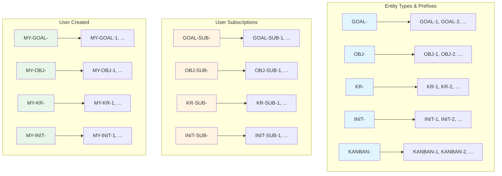
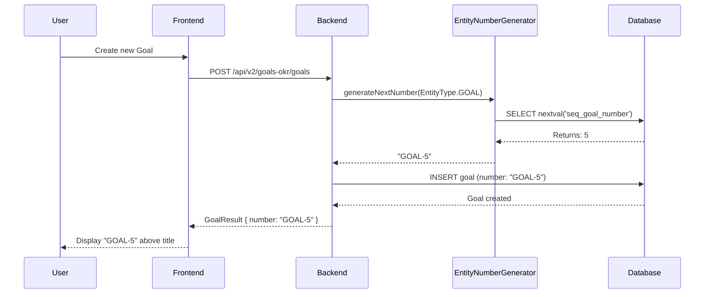
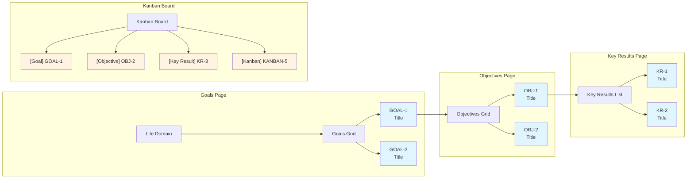

# UX Test Case: Entity Numbering Functionaliteit

## 📊 Overzicht Diagram



## 🔄 Number Generation Flow



## 📍 UI Locations Diagram



## 🎯 Doel van deze test
Verifiëren dat unieke, mens-leesbare nummers worden getoond voor alle goal-gerelateerde items, zodat gebruikers deze kunnen gebruiken voor:
- **Snel refereren** in gesprekken ("Kijk naar GOAL-1")
- **Tracking** in notities of externe tools
- **Collaboratie** met teamleden zonder verwarring
- **Professionaliteit** in rapportages

---

## 📍 Test Scenario 1: Goals Overzicht Pagina

### Waar begin je?
1. Open de applicatie in je browser
2. Navigeer naar: **Goals & OKR** → **Life Domain** (bijv. "Religion / ʿIbādah")
3. Je komt op de Goals overzicht pagina

### Wat moet je zien?
✅ **Boven elke goal card** zie je een klein, grijze tekst in monospace font:
   - Bijvoorbeeld: `GOAL-1`, `GOAL-2`, `GOAL-3`
   - Deze staat **boven** de goal titel
   - Kleur: grijs/muted (niet opvallend, maar wel zichtbaar)

### Wat moet je doen?
1. **Bekijk de goals** - Controleer dat elke goal een nummer heeft
2. **Klik op een goal** - Navigeer naar de objectives pagina
3. **Noteer het nummer** - Bijvoorbeeld "GOAL-1" voor later gebruik

### Waarom?
- **Use case**: "Ik wil met mijn coach praten over GOAL-1, maar ik weet de exacte titel niet uit mijn hoofd"
- **Value**: Snel refereren zonder lange titels te typen

---

## 📍 Test Scenario 2: Objectives & Key Results

### Waar begin je?
1. Vanuit Test Scenario 1, klik op een goal (bijv. "Dagelijks gebed consistent verrichten")
2. Je komt op de Objectives pagina voor die goal

### Wat moet je zien?
✅ **Boven elke objective card** zie je een klein, grijze tekst in monospace font:
   - Bijvoorbeeld: `OBJ-1`, `OBJ-2`, `OBJ-3`
   - Deze staat **boven** de objective titel
   - Kleur: grijs/muted (niet opvallend, maar wel zichtbaar)

✅ **Boven elke key result card** zie je een klein, grijze tekst in monospace font:
   - Bijvoorbeeld: `KR-1`, `KR-2`, `KR-3`
   - Deze staat **boven** de key result titel
   - Kleur: grijs/muted (niet opvallend, maar wel zichtbaar)

### Wat moet je doen?
1. **Bekijk objectives** - Controleer of nummers zichtbaar zijn
2. **Klik op een objective** - Bekijk de key results
3. **Noteer de nummers** - Bijvoorbeeld "OBJ-1 heeft KR-1 en KR-2"

### Waarom?
- **Use case**: "In mijn weekly review wil ik zeggen: 'OBJ-1 is 80% compleet, maar KR-2 loopt achter'"
- **Value**: Precieze communicatie zonder verwarring over welke objective/key result je bedoelt

---

## 📍 Test Scenario 3: Kanban Board (Progress Tracking)

### Waar begin je?
1. Navigeer naar: **Goals & OKR** → **Progress Board** (of **Kanban Board**)
2. Je ziet 4 kolommen: TODO, IN_PROGRESS, IN_REVIEW, DONE

### Wat moet je zien?
✅ **Op elke kanban card** zie je:
   - **Item type badge**: "Goal", "Objective", "Key Result", of "Initiative"
   - **Nummer ernaast**: Bijvoorbeeld `GOAL-1`, `OBJ-2`, `KR-3`, `KANBAN-5`
   - Deze staan **naast elkaar** op dezelfde regel, onder de titel

### Wat moet je doen?
1. **Bekijk bestaande items** - Controleer dat elk item een nummer heeft
2. **Maak een nieuw kanban item aan**:
   - Ga naar een goal pagina
   - Klik op "Add to Progress" (of vergelijkbare button)
   - Selecteer een goal/objective/key result
3. **Controleer het nieuwe item**:
   - Ga terug naar Kanban Board
   - Zoek het nieuwe item
   - **VERIFIEER**: Heeft het automatisch een nummer gekregen? (bijv. `KANBAN-6`)

### Waarom?
- **Use case**: "Ik wil in mijn standup zeggen: 'KANBAN-12 is klaar voor review'"
- **Value**: Eenvoudig tracken van werk items zonder te zoeken naar IDs of titels

---

## 📍 Test Scenario 4: Nieuwe Entity Aanmaken

### Waar begin je?
1. Navigeer naar een plek waar je een nieuwe goal/objective/key result/initiative kunt aanmaken
2. *Let op: Dit hangt af van welke create functionaliteit beschikbaar is in de UI*

### Wat moet je doen?
1. **Maak een nieuwe entity aan**:
   - Vul de vereiste velden in (titel, beschrijving, etc.)
   - Sla op
2. **Controleer direct na aanmaken**:
   - Wordt het nummer **direct** getoond?
   - Is het nummer **uniek** (niet hetzelfde als een bestaand item)?
   - Volgt het het juiste **format** (bijv. `GOAL-5` voor de 5e goal)?

### Wat moet je zien?
✅ **Direct na aanmaken**:
   - Het nieuwe item heeft een nummer
   - Het nummer volgt het juiste prefix (GOAL-, OBJ-, KR-, INIT-, KANBAN-)
   - Het nummer is sequentieel (niet random)

### Waarom?
- **Use case**: "Ik maak een nieuwe goal aan en wil direct weten wat het nummer is voor mijn notities"
- **Value**: Geen wachten of handmatig opzoeken nodig

---

## ✅ Checklist: Wat moet werken?

### Visueel
- [ ] Goals tonen nummers op de goals overzicht pagina
- [ ] Objectives tonen nummers op de objectives pagina
- [ ] Key Results tonen nummers op de key results pagina
- [ ] Kanban items tonen nummers op het kanban board
- [ ] Nummers zijn zichtbaar maar niet opvallend (muted color, small font)
- [ ] Nummers gebruiken monospace font voor leesbaarheid

### Functionaliteit
- [ ] Bestaande items hebben nummers (migratie succesvol)
- [ ] Nieuwe items krijgen automatisch een nummer
- [ ] Nummers zijn uniek (geen duplicaten)
- [ ] Nummers volgen het juiste format (prefix + nummer)
- [ ] Nummers zijn sequentieel (1, 2, 3, ...)

### Use Cases
- [ ] Ik kan een nummer gebruiken om te refereren in een gesprek
- [ ] Ik kan een nummer kopiëren en plakken in notities
- [ ] Nummers zijn consistent tussen verschillende pagina's
- [ ] Nummers helpen bij het organiseren van mijn werk

---

## 🐛 Mogelijke Issues om te Checken

### Als nummers NIET zichtbaar zijn:
1. **Hard refresh** de pagina (Ctrl+Shift+R / Cmd+Shift+R)
2. Check browser console voor errors
3. Check of de API response het `number` veld bevat (Network tab)
4. Check of de frontend component het `number` veld rendert

### Als nummers ONJUIST zijn:
1. Check of de migratie is uitgevoerd (V37)
2. Check of nieuwe items nummers krijgen (mogelijk alleen bestaande items hebben nummers)
3. Check of de sequence correct is geïnitialiseerd

### Als nummers ONTBREKEN op bepaalde pagina's:
1. Check of die component het `number` veld toont
2. Check of de API endpoint het `number` veld teruggeeft
3. Check of de DTO interface het `number` veld heeft

---

## 📝 Test Resultaten Template

```
Test Datum: [datum]
Tester: [naam]
Browser: [Chrome/Firefox/Safari]

✅ Goals Overzicht: [PASS/FAIL] - Notities: [opmerkingen]
✅ Objectives Pagina: [PASS/FAIL] - Notities: [opmerkingen]
✅ Key Results: [PASS/FAIL] - Notities: [opmerkingen]
✅ Kanban Board: [PASS/FAIL] - Notities: [opmerkingen]
✅ Nieuwe Entity: [PASS/FAIL] - Notities: [opmerkingen]

Issues Gevonden:
- [ ] [beschrijving issue]
- [ ] [beschrijving issue]

Algemene Opmerkingen:
[opmerkingen over UX, visuele presentatie, etc.]
```

---

## 🎨 Visuele Referentie

### Goals Card (NavGoal.tsx)
```
┌─────────────────────────────────┐
│ GOAL-1                    [➕]  │  ← Nummer hier (klein, grijs)
│ Dagelijks gebed consistent     │
│ verrichten                      │
│                                 │
│ Alle vijf dagelijkse gebeden... │
└─────────────────────────────────┘
```

### Kanban Card (KanbanBoard.tsx)
```
┌─────────────────────────────────┐
│ [⋮⋮] 30 dagen op tijd      [🔗][🗑]│
│      [Goal] GOAL-1              │  ← Type badge + nummer
└─────────────────────────────────┘
```

---

## 💡 Tips voor Testen

1. **Test met verschillende browsers** - Zorg dat het consistent werkt
2. **Test op mobiel** - Check of nummers zichtbaar blijven op kleine schermen
3. **Test met meerdere gebruikers** - Verifieer dat nummers uniek zijn per gebruiker (voor user-created items)
4. **Test edge cases**:
   - Wat gebeurt er als je snel meerdere items aanmaakt?
   - Zijn nummers consistent als je de pagina refresh?
   - Werken nummers in verschillende talen (NL/EN)?

---

## 🚀 Volgende Stappen na Testen

Als alles werkt:
- ✅ Documenteer de use cases voor gebruikers
- ✅ Overweeg om nummers clickable te maken (link naar detail pagina)
- ✅ Overweeg zoek functionaliteit op nummer

Als er issues zijn:
- 📝 Documenteer de issues
- 🔧 Fix de bugs
- 🔄 Herhaal de test
